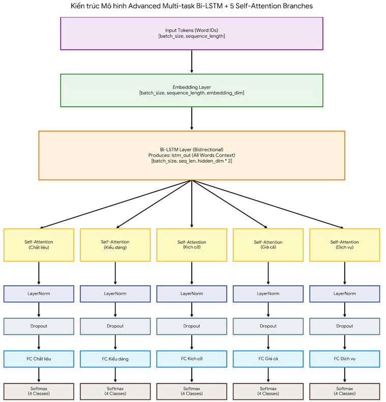

# Aspect-Based Sentiment Analysis of Vietnamese User Reviews in the Fashion Domain


## 📌 Project Overview
This project implements an **Aspect-Based Sentiment Analysis (ABSA)** system tailored for Vietnamese customer reviews in the fashion domain. The goal is to accurately classify customer attitudes (Negative, Neutral, Positive, or Not Mentioned) toward specific product attributes: **Material, Style, Size, Price, and Service**.

## 💻 Installation & Setup

1. **Clone the repository:**

   ```bash
   git clone https://github.com/chauquocvinh2234/Aspect-Based_Sentiment_Analysis_for_Vietnamese_Fashion_Reviews.git
   cd Aspect-Based_Sentiment_Analysis_for_Vietnamese_Fashion_Reviews
   ```

2. **Set up a virtual environment (Optional but recommended):**

   ```bash
   python -m venv venv
   source venv/bin/activate  # On Windows use: venv\Scripts\activate
   ```

3. **Install dependencies:**

   ```bash
   pip install -r requirements.txt
   ```

## 📊 Dataset
The training data consists of Vietnamese reviews collected from various e-commerce platforms. To optimize the repository size and ensure fast data loading, the dataset is hosted separately on Hugging Face.

🔗 **[View and Download Dataset on Hugging Face](https://huggingface.co/datasets/vinhplaykennen/FashionReviews)**

**Quick Load via Python:**
```python
# pip install datasets
from datasets import load_dataset

dataset = load_dataset("vinhplaykennen/FashionReviews")
print(dataset['train'][:5])
```

## 🧠 Model Architecture

Among the 6 deep learning architectures tested, the **Multi-Branch Bi-LSTM with Self-Attention (Branch-wise)** architecture achieved the highest overall accuracy. This model successfully handles the multi-output task, effectively capturing the distinct contextual nuances of each aspect within Vietnamese fashion reviews.

Below is the comprehensive visual diagram of our top-performing architecture:



### 🔬 Other Experimental Baselines
To maintain a clean and concise documentation page, the visual diagrams for the other 5 experimental architectures are hosted within the repository and can be viewed directly via the links below:

* [Vanilla RNN Architecture Diagram](Images/VanillaRNN_Architecture.jpg)
* [Standard LSTM Architecture Diagram](Images/LSTM_Architecture.jpg)
* [Standard GRU Architecture Diagram](Images/GRU_Architecture.jpg)
* [Standard Bi-LSTM Architecture Diagram](Images/BiLSTM_Architecture.jpg)
* [Bi-LSTM with Global Self-Attention Diagram](Images/BiLSTM_Self-attention_Architecture.jpg)

## 📈 Model Performance (Accuracy)

To thoroughly evaluate the classification capabilities of our system, we conducted experiments using two different word embedding techniques: **CBOW + FastText** and **SkipGram**. All models were trained using a multi-branch (multi-output) architecture to simultaneously predict 5 distinct aspects.

### 1. Embedding: CBOW + FastText
| Aspect | RNN | LSTM | GRU | Bi-LSTM | Bi-LSTM <br> Self-Attention | Bi-LSTM <br> Self-Attention <br> (Branch-wise) |
|:---|:---:|:---:|:---:|:---:|:---:|:---:|
| **Material** *(Chất liệu)* | 0.36 | 0.88 | **0.89** | **0.89** | **0.89** | **0.89** |
| **Style** *(Kiểu dáng)* | 0.37 | 0.87 | **0.88** | **0.88** | 0.87 | **0.88** |
| **Size** *(Kích cỡ)* | 0.36 | 0.85 | 0.84 | 0.85 | 0.85 | **0.86** |
| **Price** *(Giá cả)* | 0.51 | **0.93** | **0.93** | **0.93** | **0.93** | **0.93** |
| **Service** *(Dịch vụ)* | 0.46 | 0.90 | 0.90 | 0.90 | **0.91** | 0.90 |

### 2. Embedding: SkipGram
| Aspect | RNN | LSTM | GRU | Bi-LSTM | Bi-LSTM <br> Self-Attention | Bi-LSTM <br> Self-Attention <br> (Branch-wise) |
|:---|:---:|:---:|:---:|:---:|:---:|:---:|
| **Material** *(Chất liệu)* | 0.38 | 0.89 | **0.90** | **0.90** | **0.90** | **0.90** |
| **Style** *(Kiểu dáng)* | 0.37 | **0.89** | **0.89** | **0.89** | **0.89** | **0.89** |
| **Size** *(Kích cỡ)* | 0.34 | 0.86 | 0.85 | 0.86 | **0.87** | **0.87** |
| **Price** *(Giá cả)* | 0.26 | **0.93** | **0.93** | **0.93** | **0.93** | **0.93** |
| **Service** *(Dịch vụ)* | 0.36 | **0.91** | 0.90 | **0.91** | **0.91** | **0.91** |

*💡 **Evaluation Summary:** Overall, the **SkipGram** embedding slightly outperforms CBOW + FastText across most aspects (especially in Size and Style). Among the architectures, the **Bi-LSTM Self-Attention (Branch-wise)** consistently delivers the most robust and highest accuracy, proving its effectiveness in capturing aspect-specific contextual nuances in Vietnamese fashion reviews.*

## 📂 Folder Structure

```text
Aspect-Based_Sentiment_Analysis/
├── Embedding_Model/          # Contains notebooks for training word embedding models used for text representation (e.g., FastText, CBOW).
│   └── Embedding_CBOW_...
│
├── Preprocessing/            # Contains notebooks for raw data preprocessing, including text cleaning, OCR extraction, and LLM-assisted processing.
│   ├── OCR_TienXuLyVoiLLM.ipynb
│   └── TienXuLyTho.ipynb
│
├── TextClassification_Model/ # Contains notebooks for training various Deep Learning models for the sentiment classification task (e.g., RNN, LSTM, BiLSTM with Attention).
│   ├── FastText_Adv-BiLSTM...
│   ├── FastText_BiLSTM...
│   └── ...
│
├── BaoCao.pptx               # Project presentation slide deck
├── README.md                 # Project documentation
└── requirements.txt          # List of dependencies to install
```

## 🤝 Contributors
- Châu Quốc Vinh
  + [Github](https://github.com/chauquocvinh2234)
  + [Gmail](vinhit220304@gmail.com)
- Vũ Trọng Nghĩa
  + [Github](https://github.com/TrongNghia041104)
  + [Gmail](nghia.hpotaku04@gmail.com)
